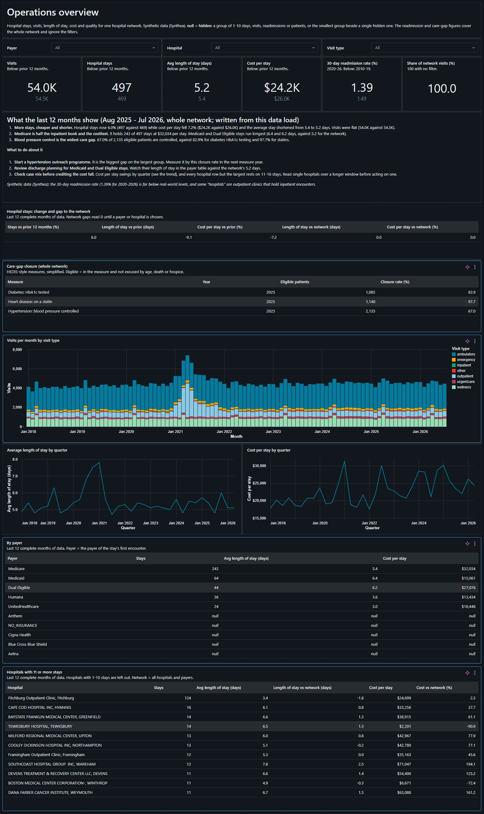

# healthcare-lakehouse

Healthcare data engineering + AI on Databricks Free Edition.

Synthetic EHR data (Synthea) → medallion lakehouse → governed PHI layer →
analytics → ML. Orchestrated with Airflow, deployed as a public Streamlit app.

**Live:** https://healthcarelakehouse.streamlit.app/

**Status:** The public app was redesigned (D76): the home page is the pipeline drawn
as a map, and each stop is a chapter written like a research paper. Chapter 7
puts phase 8's operations dashboard on the public page for the first time (D77). Phase 9
complete: an Airflow DAG that retrains on drift,
replayed year by year over 2021-2026 before it was allowed to move the live
model. It judges the review workload, not accuracy, and it found its own
limits (D75). Phase 8 added an AI/BI operations dashboard for a hospital
quality and operations director, kept as code, with every small number
hidden by construction (D74). Phase 7 made gold's invariants stop the
pipeline when they break; on their first runs they caught two silent bugs.

Phase 6 asked: can a model beat one rule ("heart disease or stroke on the
admit day") at spotting 30-day readmissions? Trained on stays
up to 2019 and judged on 2020-2026, a gradient-boosted model caught more
readmissions than the rule at the same number of alerts, but not enough to
rule out luck: **no better**. Without the bypass-surgery population it
pointed the model's way, on 17 readmissions, too few to judge. The phase's
real product is the platform around the model: experiments, a registry,
batch scoring and a drift monitor, which says the 2020-2026 patients are
older and sicker than the ones the model learned from.

## The app

The home page is the lakehouse drawn as a transit map: Synthea, bronze,
silver, gold, then the story, the model and the retraining loop, with the
operations dashboard on a spur off gold. Each station carries the one number
its chapter answers and opens that chapter. The first six chapters read like a research paper: a standfirst, the key numbers, numbered
figures, a verdict stamped on the page, and every caveat and decision number
in the margin. Bronze, silver and gold are the map's lines and the pages'
accents, in light or dark to match the reader (D76).

| Chapter | What it answers |
|---|---|
| 01 The data arrives | how much landed, and what failed a rule (kept, not dropped) |
| 02 Hiding the patients | how well four programs hid private details, and who could still be picked out |
| 03 Care gaps | three quality measures, read as the generator's rules |
| 04 Who comes back | the 30-day readmission story, in five sections (earlier sections call it app page 4) |
| 05 Can a model beat one rule? | the model's verdict and its drift (app page 5) |
| 06 The model keeps its promise | phase 9's retraining loop, replayed and then run live |
| 07 Running the network | phase 8's dashboard, default view: KPIs against the prior year, findings and recommendations, trends, payers and hospitals |

It reads only the published snapshots, never the warehouse. Every number on
it is computed from them, and any group of 1-10 is hidden. Chapter 7's numbers
come from the dashboard's own SQL, and its hospital and insurer names are made
up before publishing: Synthea takes them from real ones (D77).

## What phase 9 produced

**A retraining loop that acts on drift, replayed before it was trusted.**
The data never changes: both Synthea batches cover one fixed calendar. So
each run of a new Airflow DAG, `retrain`, is told "today is `as_of`" and
sees only what was known then. Six yearly runs replayed 2021-2026 in a
sandbox, then one live run applied the same rule for real (D75).

**What it judges is workload, not accuracy.** With about 5 readmissions a
year, no one-year window can show that one model ranks better than
another. What drift did measurably is make nurses review more charts: the
cutoff was set to flag 21.8% of stays, and on 2020 patients it flagged
31.6%.
- **The trigger:** when the champion's flag rate on the last 12 months
  leaves the 21.8% budget (95% interval).
- **Two challengers:** a new cutoff on the same model, and a retrained
  model.
- **The winner:** the simpler one that brings the rate back to budget and
  is not clearly worse at ranking.

| Cursor (checks) | Champion's flag rate (95%) | New cutoff | Retrain | Outcome |
|---|---|---|---|---|
| 2021 (2020) | 31.6% (27.4-36.1) | 23.0% pass | 23.7% pass | **new cutoff promoted** |
| 2022 (2021) | 21.2% (17.6-25.2) | | | no trigger |
| 2023 (2022) | 23.3% (19.1-28.2) | | | no trigger |
| 2024 (2023) | 25.2% (20.9-30.1) | | | no trigger |
| 2025 (2024) | 26.1% (21.8-30.9) | | | no trigger |
| 2026 (2025) | 27.7% (23.3-32.6) | 26.6% fail | 29.4% fail | **none passed** |
| live, 2026-07-15 | 33.5% (28.9-38.5) | 20.3% pass | 23.0% pass | **new cutoff → live `champion`** |

**What it found:**
- **The drift began before 2020.** A cutoff set on 2019 alone already
  fitted 2020, which answers what phase 6 left open.
- **Moving the cutoff was always enough.** Retraining never did better.
- **The loop's limits.** After one fix, the rate crept up about 1.5 points
  a year, which a trigger with a ±4.5-point interval cannot see. When it
  fired again, a cutoff learned from the year before was a year behind.
  Every decision rests on about 350 stays, and moving the window by six
  months moved one verdict across the line.

**The pieces:**
- **The DAG** checks that the pipeline's last update passed its gates
  before anything trains. It was seen refusing, with no compute spent.
- **One notebook** does the work, with an order guard so no year is
  skipped or decided twice.
- **`ml.retrain_history`** keeps every decision, rates and verdicts only.
- **Scoring** never scores a model's own training stays.

The sandbox was checked unchanged before the live run.

## What phase 8 produced

**One dashboard page for a hospital quality and operations director.** It
answers how busy the network was, how long patients stayed, what a stay
cost, how often patients came back and whether care gaps are closing,
overall and by payer and hospital.



- **KPI tiles against a benchmark:** visits, hospital stays, average length
  of stay and cost per stay for the last 12 complete months, each against
  the 12 before. Once a payer or hospital is chosen, there is a gap to the
  network average.
- **Filters** for payer, hospital and visit type. Trends by month (visits)
  and by quarter (length of stay and cost, because 40 stays a month is
  noise). Variation tables by payer and by hospital. Care-gap closure for
  three HEDIS-style measures.
- **The readmission tile uses wide periods** (2020-2026 against
  2010-2019). Readmissions are rare enough that 12 months would almost
  always hold 1-10, a number the project never shows (D66, D70).

**What the last 12 months show** (Aug 2025 - Jul 2026, whole network,
synthetic data)
1. **More stays, cheaper and shorter.** Hospital stays rose 6.0% (497
   against 469) while cost per stay fell 7.2% ($24.2K against $26.0K) and
   the average stay shortened from 5.4 to 5.2 days. Visits were flat.
2. **Medicare is half the inpatient book and the costliest:** 243 of 497
   stays at $32,034 per stay. Medicaid and Dual Eligible stays run longest
   (6.4 and 6.2 days, against 5.2).
3. **Blood pressure control is the widest care gap:** 67.0% of 2,135
   eligible patients, against 82.9% for HbA1c testing and 97.7% for statins.

**What to do about it**
1. **Start hypertension outreach.** It is the biggest gap on the largest
   group. Measure it by this closure rate in the next measure year.
2. **Review discharge planning for Medicaid and Dual Eligible stays.** Watch
   their length of stay against the network's.
3. **Check case mix before crediting the cost fall.** Cost per stay swings by
   quarter, and every hospital row but the largest rests on 11-16 stays.

**How it is built:**
- **Every KPI is defined once.** The dashboard reads the same Unity Catalog
  metric views as Genie and the text-to-SQL test. `metrics.operations` and
  `metrics.care_gaps` are new. `metrics.stays` gained hospital, payer,
  month, cost and length of stay, which `readmission_events` now computes for
  every stay. It moved there from the model's table, and that table was
  proved unchanged to the cent.
- **Small numbers are hidden by construction.** Every number a dataset
  returns passes through one SQL function, `metrics.shown()`. Filters are
  query parameters, so the rule sees the filtered group. The payer table sits
  beside its own total (the stays tile), so it also hides as few further
  payers as it takes for a hidden one to hold anything from 1 to 10 stays
  (secondary suppression with a protection interval). On the default view,
  no other table or chart has a hidden cell that a total could give back
  (checked). A pytest reads the dashboard file and checks its shape: every
  number is one `shown()` call, every dataset applies its filters, nothing
  wraps the final query, the payer table keeps its suppression, and no
  widget re-adds rows.
- **The dashboard is code.** `dashboards/operations.lvdash.json` deploys with
  `databricks bundle deploy`, like the pipeline. Behind the workspace login
  the screenshot carries it. It reads `healthcare_dev` and is deployed to dev
  only.

## What phase 7 produced

**Gold that fails loudly instead of quietly.** dbt was planned here and cut
(D73): each thing it would have added already exists in the pipeline.
- The gold layer's invariants are pipeline expectations that fail the
  update: 15 row gates in the tables they protect, which stop a bad build
  before it replaces the table, and 22 cross-table gates in one
  `gold_checks` view.
- `readmission_signals` declares its columns and types, so a change that
  would break the model fails at validation.
- A silver gate promised in phase 2, but never attached, now is.

**On their first runs the gates caught two silent bugs** (E58, E59). A
change in the Databricks pipeline runtime stopped `SELECT DISTINCT` from
removing duplicates inside the pipeline: one gold table miscounted
encounters, and the model's input table came out with 738 duplicate stays.
Neither reached the model or the app. Both are fixed, and duplicate keys
are now refused before a table is replaced.

Every gold table was then shown identical to its state before the phase
(a row-count and hash fingerprint), and the fixed table equal to the
independent PySpark build.

## What phase 6 produced

**A model lifecycle on Free Edition, judged only against baselines** (app
page 5). Absolute performance on synthetic data means nothing; only the
comparison with the rule does.

| | All index stays | Without bypass surgery |
|---|---|---|
| Training (to 2019) / production (2020-2026) stays | about 8,200 / 2,451 | about 7,700 / 2,208 |
| Production readmissions | 34 | 17 |
| Champion, chosen by patient-grouped cross-validation | gradient boosting | logistic regression |
| Readmissions caught, model minus rule (95%, patients resampled) | +12.2 points (-3.0 to +29.0) | +35.7 points (+7.1 to +64.8) |
| Verdict | **no better** | **too few to judge** (under 30) |


*Each population's champion in MLflow, version 1 and version 2 (after the
final review, D72): average precision, Brier, cross-validated average
precision and the interval of the difference from the rule. The rule's own
rows are left out: for a yes/no rule, its average precision gives the
counts back.*

- **The pieces:** MLflow experiments (every candidate, both baselines, the
  champion), Unity Catalog models with a `champion` alias and a
  `beats_rule` tag, batch scores in `ml.readmission_scores`, and a drift
  report in `ml.drift_report`. The rules are pure Python with local tests;
  three notebooks run them as serverless jobs.
- **Ranking is not calibration:** the model's average precision is about
  twice the rule's, but its Brier score is no better than the base rate's.
- **Drift:** production patients are older (mean age 41.7 to 52.2) and
  sicker (heart disease or stroke 21.8% to 35.4% of stays), and COVID-19 arrives
  as an admit reason training never saw. The model flags 31-36% of stays in
  every year against about 22% in training. The readmission rate itself did not
  move measurably. PSI read the heart-disease jump as "stable", so
  true/false features are judged by their rate instead (D71).
- **Getting the registry to work** took MLflow 3.16.1 plus a Files API
  switch (E52), and naming the three types skops may load (E56).

## What phase 5 produced

**One question, five chapters** (app page 4): how big is the problem, who
comes back, what happened around the stay, what it costs, and could we have
seen it coming. Every finding says "in this synthetic data", and every
signal carries a label: the Synthea rule that produces it, or "not traced".

| | |
|---|---:|
| Index stays (both Synthea batches, 12,580 patients) | 10,724 |
| 30-day readmissions | **140 (1.31%)**, from 127 patients |
| Signals known at discharge that separate | 9 of 11, **GO** |
| ...without the bypass rule's 91 returns | 6 |
| Test questions, written by hand and frozen before the metric views | 20 |

**The rate moved twice, and both moves were planned care counted as
relapse.** Phase 4's 17.54% was mostly chemotherapy cycles (D64); 33 more
"readmissions" were returns for scheduled heart surgery
(D68). A second batch of ~11,000 patients (D65) took the readmissions from
17 to enough to test anything.

**The rule for "could we see it coming" was fixed before the numbers were
read:** a level separates when both sides have 30+ stays, the higher rate
comes from 10+ different patients, and the 95% Wilson intervals do not
overlap. GO needs two such signals. Groups with 1-10 stays or readmissions
are hidden on the page, along with the one level that would give them back
by subtraction (D66).

**Text-to-SQL, on the story's own questions:**

| Contestant | test-1 | test-2 |
|---|---:|---:|
| Answer key (control) | 20 | 20 |
| Genie + metric views | **16** | **15** |
| Llama 3.3 70B + metric views | 12 | 13 |
| Llama 3.3 70B + gold tables | 10 | 11 |

Verdicts move by 1-2 between identical runs. Genie led the metric layer by
4 and then 2, so its lead is likely but not firm, and metric vs raw is
within noise. The metric layer removed the raw model's own mistakes
(columns from the wrong table, summing booleans) and its personal-data
answers, but it also capped what could be asked: two test questions needed
detail these views do not keep, and every contestant missed both. That cap
was a build choice (bands and flags only, where the spec asked for every
column), not a property of semantic layers (D70). Semantic search over medical codes was not built: wrong codes caused
0 of the dev failures (D67).

## What phase 4 produced

| | |
|---|---:|
| Gold tables | 10 |
| 30-day readmission rate | **17.54%** (201 of 1,146 index stays; phase 5 corrected it, D64 and D68) |
| Care-gap measures, 2025 | 3 |
| SQL vs PySpark, rows that differ | **0** of 1,170 and 0 of 1,148 |
| FHIR vs CSV, rows that differ | 0 of 4,362 visits and 0 of 2,426 conditions |

**Readmissions are counted per stay, not per encounter.** A hospital
encounter that starts before the last one ended, or the same day, is the same
stay. Phase 1's gate counted encounters and got 15.97%. The gold table
reproduces that exactly when merging is switched off, and
`sql/readmission_ladder.sql` accounts for every step from there to 17.54%.
Merging moved the denominator, not the numerator: 121 "admissions" were
really the middle of a stay, each counted as a patient who never came back.
Every exclusion (died, too little follow-up, hospice) is its own column,
never a hidden filter.

**Care gaps describe the generator, not the care.**

| Measure, 2025 | Eligible | Met |
|---|---:|---:|
| Blood pressure under 140/90 | 191 | 69.6% |
| Diabetics with an HbA1c test | 86 | 80.2% |
| Heart patients on a statin | 99 | 99.0% |

Synthea prescribes a statin as part of the heart treatment it simulates, so
99% says how the data was made. Seven probes ran before any table was built:
the heart-disease code the plan assumed had no patients, and the plan's
single diabetes code would have missed 87 of 166 diabetics.

**Two engines, one answer.** `readmission_events` and `patient_360` were
built a second time with the PySpark DataFrame API and compared with
`exceptAll` in both directions: 0 differences. The second version was
written with knowledge of the first, so it proves the translation more than
the rules; the rules were proven against the phase 1 gate.

**FHIR, the job SQL is bad at.** The 25 test patients' FHIR bundles were
flattened in PySpark and matched the CSVs row for row. Inferring one schema
across 20 resource types silently turned a list into text (errors E48); each
resource type is now parsed with its own stated schema. Patient resources,
which hold names, are never parsed.

Gold is as private as silver (exact visit dates), so the app's third page
gets counts per measure, never rows.

## What phase 3b produced

Synthea's 1,148 clinical notes were searched for private details by four
programs, each marked against an answer sheet of 439,651 positions built from
the patient's own record. Scored on 25 test patients, chosen before any
program ran:

| Program | Names hidden | Dates hidden |
|---|---:|---:|
| 0 · look up the patient's own details | 1.000 | 1.000 |
| 1 · patterns, no patient list | 0 | 1.000 |
| 2 · name model (`obi/deid_roberta_i2b2`) | 0.860 | 0.952 |
| 3 · language model (Llama 3.3 70B via `ai_query`) | **0.996** | 0.996 |

"Hidden" means one guess covered the whole real item; finding `Luc` in
`Lucius` does not count, because `ius` is still in the note. Program 0 is the
answer sheet, so its score proves the marking works. Program 1's perfect dates
are a property of synthetic notes, where every date-shaped string is a real
date. Both models also flag thousands of things that are not private — ages
under 90, insurers, ethnicity — which the app shows as false alarms.

The **de-identified copy** is a separate `deid` schema, so `gold` keeps
reading true values. Every patient gets a new random id and one random date
shift, stored only in `ops`. Checked: every gap between a patient's visits is
unchanged, no note still names its patient, and no date was lost.

**Following Safe Harbor was not enough.** Birth year, 3-digit ZIP and gender
left 467 of 1,148 people alone in their group. The released table drops ZIP,
uses 5-year bands, and blanks the 143 people still in groups under 5.

The four runs are recorded in MLflow; the scores and group sizes are on the
app's second page.

## What phase 3a produced

| | |
|---|---:|
| PHI columns classified | 19, in each of two schemas |
| Column mask policies | 8 |
| Row filter policies | 1 |
| Safe Harbor categories | 8 |

Masks are **ABAC policies attached to the schema**, matching governed tags —
not `MASK` clauses on columns. A column mask attached to `silver.patient`
would be lost the next time the pipeline recreated it, silently, which is the
worst possible failure for a security control. A schema policy is not part of
the table definition. Verified by full-refreshing `silver.patient` and
confirming the tags and the masking both survived.

Clearance is a row in `ops.phi_clearance`, so the mask can be shown opening and
closing on demand: `999-27-2324` → `***`, `01730` → `017`, `2022-11-30` →
`2022-01-01`. Safe Harbor permits the year and nothing finer, so the `01-01`
is fabricated and the column comment says so.

`sql/governance_check.sql` is the drift check: tags are what the policies match
on, so a lost tag silently unmasks a column. **Run it after every full
refresh.**

## What phase 2 produced

| | |
|---|---:|
| Silver tables | 12 |
| Quarantine tables | 9 |
| Rows quarantined, all tables | 104 |
| Orchestration | Airflow 3.3.2, five containers, `medallion` DAG |

Every silver table is built as a pair: a typed view carrying a `violations`
array, then a materialized view keeping only the rows where that array is
empty. The failing rows are not dropped — they land whole in
`ops.quarantine_<name>`, which is why the number above is known rather than
estimated. 104 of 3,277,048 rows failed a rule, all of them medications.

## What phase 1 produced

| | |
|---|---:|
| Patients generated | 1,148 |
| Rows landed in bronze | 3,277,048 |
| Bronze streaming tables | 12 |
| CSV on disk → Parquet | 631 MB → 47 MB |
| 30-day readmission base rate | 15.97% |

Row counts were measured locally with DuckDB before upload and re-measured in
the lakehouse afterwards. They agree entity by entity, to the row.

The readmission gate ([docs/readmission-gate.md](docs/readmission-gate.md))
existed to answer one question before any ML work was planned: does this
dataset contain a learnable target? 1,265 index admissions after excluding
in-hospital deaths and insufficient follow-up, 202 readmissions. Verdict:
proceed.

## Documents

- [Brainstorm log](docs/brainstorm-log.md) — decisions and the reasoning behind them
- [Calibration](docs/calibration.md) — measured dataset size
- [Readmission gate](docs/readmission-gate.md) — is the ML target viable
- [Decision log](docs/decision.md) — why each implementation went the way it did
- [Execution flow](docs/flow.md) — entry points and call order
- [Error log](docs/errors.md) — every failure hit, its symptom and its fix

## Running it

```bash
python -m venv .venv
.venv\Scripts\Activate.ps1
pip install -r requirements.txt
pytest
ruff check .
```

Talking to Databricks needs credentials: copy `.env.example` to `.env` and fill
it in. `.env` is gitignored.

Regenerating the dataset is documented in
[synthea/README.md](synthea/README.md). Deploying the pipeline and publishing
the snapshot run from `databricks bundle deploy` and
`python -m scripts.publish_snapshot`.

Before pushing a change to pipeline SQL, check it compiles without building
anything:

```bash
databricks bundle deploy -t dev
databricks pipelines start-update <pipeline-id> --validate-only
```

Not in CI: it needs Databricks compute, and running it on every pull request
spends the daily quota whose exhaustion locks the workspace.

### Orchestration (Airflow, needs Docker Desktop)

```bash
cd orchestration
docker compose --env-file ../.env up airflow-init
docker compose --env-file ../.env up -d
```

Open http://localhost:8080 (airflow / airflow) once `docker compose ps` shows
every service `(healthy)`, and trigger the `medallion` DAG by hand. It is never
scheduled: on Free Edition a timer-driven run can exhaust the daily quota
unattended. The `retrain` DAG is triggered the same way, one cursor per run:
`docker compose --env-file ../.env exec airflow-scheduler airflow dags trigger retrain -c '{"as_of": "2021-01-01", "mode": "replay"}'`.
It refuses to start unless the pipeline's last update passed its gates,
and refuses a year out of order. `--env-file ../.env` is how Airflow gets the Databricks credentials —
there is no second credential file.

## Architecture notes

- **Bronze does nothing.** No casting, no cleaning, no dedup. Every column
  lands as a string. Bronze exists so silver and gold can be rebuilt without
  re-uploading 631 MB.
- **One pipeline, all layers.** Free Edition permits one active pipeline per
  type, so bronze/silver/gold share a single Lakeflow Declarative Pipeline.
- **The app never queries the warehouse.** A publish step writes an
  aggregate-only Parquet snapshot to `snapshots/`, it is committed, and
  Streamlit reads that file. Per-visitor queries would wake serverless compute
  and burn the daily quota — a crawler could take the workspace down for a day.
  Snapshots are aggregates only, never row-level.
- **The data is synthetic.** Synthea output, no real patient information.

## Known Free Edition degradations

Documented rather than hidden. Knowing the gap is worth more than pretending
there is none.

| Constraint | Production would do | What this project does |
|---|---|---|
| One workspace per account | Separate dev and prod workspaces | Separate catalogs, `healthcare_dev` and `healthcare`, in one workspace |
| Service principals for CI | Service principal with scoped permissions | A PAT in GitHub Actions secrets. OIDC is the upgrade path |
| Bundle `mode: production` | Enabled, enforcing run-as and deployment rules | Omitted — its `run_as` requirements cannot be met by a single-user Free Edition account |
| One active pipeline per type | A pipeline per medallion layer | One pipeline containing all layers |
| Quota shuts down compute daily | Autoscaling production clusters | Dev tier of ~1,000 patients, plus a second batch of ~11,000 generated on the laptop as CSV only (D65); large runs are manual and deliberate |
| AI/BI dashboards sit behind the workspace login | A published dashboard shared with the business | The dashboard ships as code and is deployed by the bundle; the README carries a screenshot of the default network view |
| Databricks Apps for internal hosting | An App behind workspace SSO | Streamlit Community Cloud — Apps sit behind workspace auth and stop after 24h |
| One account, which owns every object | A service principal owns `ops`; analysts get `SELECT` on `silver` and nothing on `ops` | A row in `ops.phi_clearance`. **Separation of duties is impossible here, not merely weak** — there is one principal and it owns everything, so the masks demonstrate a mechanism and enforce nothing against their owner. A second principal is the fix; `REVOKE` is not |
| One state in the dataset | Row filters segregate by region | The filter works and is verified, but with every patient in Massachusetts it can only be all-rows or no-rows |
| No GPU, and a daily compute cap | The name model runs on GPU inference | It ran 6.5 hours on a laptop CPU after the cap stopped the Databricks job two hours in. The test set was cut to 25 patients so every program could afford it |
| A daily compute cap | FHIR flattened for every patient | The FHIR export is 12.8 GB; track A ran on the 25 test patients (316 MB). SQL-vs-PySpark timings are one run at 1,148 patients and are not a ranking |
| Billing visible only hours later | Cost per query from live metering | Text-to-SQL cost is reported as seconds per answer (Genie 16 s, Llama 2 s) |
| A fixed synthetic calendar, and a daily compute cap | Drift checks on a schedule as new data lands, retraining when they fire | No new data ever arrives, so a date cursor replays history one year per run (D75). Every run is triggered by hand |
| Unity Catalog model registry | MLflow writes model files straight to catalog storage | Free Edition denies that write; MLflow 3.16.1 with `MLFLOW_USE_DATABRICKS_SDK_MODEL_ARTIFACTS_REPO_FOR_UC` sends it through the Files API instead (E52) |
| Synthetic notes | Real notes name relatives and clinicians, and write dates many ways | Synthea notes hold first names and ISO dates only, so these scores are a ceiling for real notes, not a forecast |

## Scope rule

> Nothing enters the plan without something leaving.
