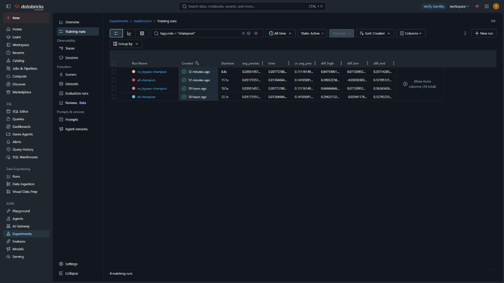

# healthcare-lakehouse

Healthcare data engineering + AI on Databricks Free Edition.

Synthetic EHR data (Synthea) → medallion lakehouse → governed PHI layer →
analytics → ML. Orchestrated with Airflow, deployed as a public Streamlit app.

**Live:** https://healthcarelakehouse.streamlit.app/

**Status:** Phase 7 complete: gold's invariants now stop the pipeline
when they break, and on their first runs they caught two silent bugs. dbt
was planned for this phase and cut (D73).

Phase 6 asked: can a model beat one rule ("heart disease or stroke on the
admit day") at spotting 30-day readmissions? Trained on stays
up to 2019 and judged on 2020-2026, a gradient-boosted model caught more
readmissions than the rule at the same number of alerts, but not enough to
rule out luck: **no better**. Without the bypass-surgery population it
pointed the model's way, on 17 readmissions, too few to judge. The phase's
real product is the platform around the model: experiments, a registry,
batch scoring and a drift monitor, which says the 2020-2026 patients are
older and sicker than the ones the model learned from.

## What phase 7 produced

**Gold that fails loudly instead of quietly.** dbt was planned here and cut
(D73): each thing it would have added already exists in the pipeline.
- The gold layer's invariants are pipeline expectations that fail the
  update: 15 row gates in the tables they protect, which stop a bad build
  before it replaces the table, and 22 cross-table gates in one
  `gold_checks` view.
- `readmission_signals` declares its columns and types, so a change that
  would break the model fails at validation.
- A silver gate promised in phase 2, but never attached, now is.

**On their first runs the gates caught two silent bugs** (E58, E59). A
change in the Databricks pipeline runtime stopped `SELECT DISTINCT` from
removing duplicates inside the pipeline: one gold table miscounted
encounters, and the model's input table came out with 738 duplicate stays.
Neither reached the model or the app. Both are fixed, and duplicate keys
are now refused before a table is replaced.

Every gold table was then shown identical to its state before the phase
(a row-count and hash fingerprint), and the fixed table equal to the
independent PySpark build.

## What phase 6 produced

**A model lifecycle on Free Edition, judged only against baselines** (app
page 5). Absolute performance on synthetic data means nothing; only the
comparison with the rule does.

| | All index stays | Without bypass surgery |
|---|---|---|
| Training (to 2019) / production (2020-2026) stays | about 8,200 / 2,451 | about 7,700 / 2,208 |
| Production readmissions | 34 | 17 |
| Champion, chosen by patient-grouped cross-validation | gradient boosting | logistic regression |
| Readmissions caught, model minus rule (95%, patients resampled) | +12.2 points (-3.0 to +29.0) | +35.7 points (+7.1 to +64.8) |
| Verdict | **no better** | **too few to judge** (under 30) |



*Each population's champion in MLflow, version 1 and version 2 (after the
final review, D72): average precision, Brier, cross-validated average
precision and the interval of the difference from the rule. The rule's own
rows are left out: for a yes/no rule, its average precision gives the
counts back.*

- **The pieces:** MLflow experiments (every candidate, both baselines, the
  champion), Unity Catalog models with a `champion` alias and a
  `beats_rule` tag, batch scores in `ml.readmission_scores`, and a drift
  report in `ml.drift_report`. The rules are pure Python with local tests;
  three notebooks run them as serverless jobs.
- **Ranking is not calibration:** the model's average precision is about
  twice the rule's, but its Brier score is no better than the base rate's.
- **Drift:** production patients are older (mean age 41.7 to 52.2) and
  sicker (heart disease or stroke 21.8% to 35.4% of stays), and COVID-19 arrives
  as an admit reason training never saw. The model flags 31-36% of stays in
  every year against about 22% in training. The readmission rate itself did not
  move measurably. PSI read the heart-disease jump as "stable", so
  true/false features are judged by their rate instead (D71).
- **Getting the registry to work** took MLflow 3.16.1 plus a Files API
  switch (E52), and naming the three types skops may load (E56).

## What phase 5 produced

**One question, five chapters** (app page 4): how big is the problem, who
comes back, what happened around the stay, what it costs, and could we have
seen it coming. Every finding says "in this synthetic data", and every
signal carries a label: the Synthea rule that produces it, or "not traced".

| | |
|---|---:|
| Index stays (both Synthea batches, 12,580 patients) | 10,724 |
| 30-day readmissions | **140 (1.31%)**, from 127 patients |
| Signals known at discharge that separate | 9 of 11, **GO** |
| ...without the bypass rule's 91 returns | 6 |
| Test questions, written by hand and frozen before the metric views | 20 |

**The rate moved twice, and both moves were planned care counted as
relapse.** Phase 4's 17.54% was mostly chemotherapy cycles (D64); 33 more
"readmissions" were returns for scheduled heart surgery
(D68). A second batch of ~11,000 patients (D65) took the readmissions from
17 to enough to test anything.

**The rule for "could we see it coming" was fixed before the numbers were
read:** a level separates when both sides have 30+ stays, the higher rate
comes from 10+ different patients, and the 95% Wilson intervals do not
overlap. GO needs two such signals. Groups with 1-10 stays or readmissions
are hidden on the page, along with the one level that would give them back
by subtraction (D66).

**Text-to-SQL, on the story's own questions:**

| Contestant | test-1 | test-2 |
|---|---:|---:|
| Answer key (control) | 20 | 20 |
| Genie + metric views | **16** | **15** |
| Llama 3.3 70B + metric views | 12 | 13 |
| Llama 3.3 70B + gold tables | 10 | 11 |

Verdicts move by 1-2 between identical runs. Genie led the metric layer by
4 and then 2, so its lead is likely but not firm, and metric vs raw is
within noise. The metric layer removed the raw model's own mistakes
(columns from the wrong table, summing booleans) and its personal-data
answers, but it also capped what could be asked: two test questions needed
detail these views do not keep, and every contestant missed both. That cap
was a build choice (bands and flags only, where the spec asked for every
column), not a property of semantic layers (D70). Semantic search over medical codes was not built: wrong codes caused
0 of the dev failures (D67).

## What phase 4 produced

| | |
|---|---:|
| Gold tables | 10 |
| 30-day readmission rate | **17.54%** (201 of 1,146 index stays; phase 5 corrected it, D64 and D68) |
| Care-gap measures, 2025 | 3 |
| SQL vs PySpark, rows that differ | **0** of 1,170 and 0 of 1,148 |
| FHIR vs CSV, rows that differ | 0 of 4,362 visits and 0 of 2,426 conditions |

**Readmissions are counted per stay, not per encounter.** A hospital
encounter that starts before the last one ended, or the same day, is the same
stay. Phase 1's gate counted encounters and got 15.97%. The gold table
reproduces that exactly when merging is switched off, and
`sql/readmission_ladder.sql` accounts for every step from there to 17.54%.
Merging moved the denominator, not the numerator: 121 "admissions" were
really the middle of a stay, each counted as a patient who never came back.
Every exclusion (died, too little follow-up, hospice) is its own column,
never a hidden filter.

**Care gaps describe the generator, not the care.**

| Measure, 2025 | Eligible | Met |
|---|---:|---:|
| Blood pressure under 140/90 | 191 | 69.6% |
| Diabetics with an HbA1c test | 86 | 80.2% |
| Heart patients on a statin | 99 | 99.0% |

Synthea prescribes a statin as part of the heart treatment it simulates, so
99% says how the data was made. Seven probes ran before any table was built:
the heart-disease code the plan assumed had no patients, and the plan's
single diabetes code would have missed 87 of 166 diabetics.

**Two engines, one answer.** `readmission_events` and `patient_360` were
built a second time with the PySpark DataFrame API and compared with
`exceptAll` in both directions: 0 differences. The second version was
written with knowledge of the first, so it proves the translation more than
the rules; the rules were proven against the phase 1 gate.

**FHIR, the job SQL is bad at.** The 25 test patients' FHIR bundles were
flattened in PySpark and matched the CSVs row for row. Inferring one schema
across 20 resource types silently turned a list into text (errors E48); each
resource type is now parsed with its own stated schema. Patient resources,
which hold names, are never parsed.

Gold is as private as silver (exact visit dates), so the app's third page
gets counts per measure, never rows.

## What phase 3b produced

Synthea's 1,148 clinical notes were searched for private details by four
programs, each marked against an answer sheet of 439,651 positions built from
the patient's own record. Scored on 25 test patients, chosen before any
program ran:

| Program | Names hidden | Dates hidden |
|---|---:|---:|
| 0 · look up the patient's own details | 1.000 | 1.000 |
| 1 · patterns, no patient list | 0 | 1.000 |
| 2 · name model (`obi/deid_roberta_i2b2`) | 0.860 | 0.952 |
| 3 · language model (Llama 3.3 70B via `ai_query`) | **0.996** | 0.996 |

"Hidden" means one guess covered the whole real item; finding `Luc` in
`Lucius` does not count, because `ius` is still in the note. Program 0 is the
answer sheet, so its score proves the marking works. Program 1's perfect dates
are a property of synthetic notes, where every date-shaped string is a real
date. Both models also flag thousands of things that are not private — ages
under 90, insurers, ethnicity — which the app shows as false alarms.

The **de-identified copy** is a separate `deid` schema, so `gold` keeps
reading true values. Every patient gets a new random id and one random date
shift, stored only in `ops`. Checked: every gap between a patient's visits is
unchanged, no note still names its patient, and no date was lost.

**Following Safe Harbor was not enough.** Birth year, 3-digit ZIP and gender
left 467 of 1,148 people alone in their group. The released table drops ZIP,
uses 5-year bands, and blanks the 143 people still in groups under 5.

The four runs are recorded in MLflow; the scores and group sizes are on the
app's second page.

## What phase 3a produced

| | |
|---|---:|
| PHI columns classified | 19, in each of two schemas |
| Column mask policies | 8 |
| Row filter policies | 1 |
| Safe Harbor categories | 8 |

Masks are **ABAC policies attached to the schema**, matching governed tags —
not `MASK` clauses on columns. A column mask attached to `silver.patient`
would be lost the next time the pipeline recreated it, silently, which is the
worst possible failure for a security control. A schema policy is not part of
the table definition. Verified by full-refreshing `silver.patient` and
confirming the tags and the masking both survived.

Clearance is a row in `ops.phi_clearance`, so the mask can be shown opening and
closing on demand: `999-27-2324` → `***`, `01730` → `017`, `2022-11-30` →
`2022-01-01`. Safe Harbor permits the year and nothing finer, so the `01-01`
is fabricated and the column comment says so.

`sql/governance_check.sql` is the drift check: tags are what the policies match
on, so a lost tag silently unmasks a column. **Run it after every full
refresh.**

## What phase 2 produced

| | |
|---|---:|
| Silver tables | 12 |
| Quarantine tables | 9 |
| Rows quarantined, all tables | 104 |
| Orchestration | Airflow 3.3.2, five containers, `medallion` DAG |

Every silver table is built as a pair: a typed view carrying a `violations`
array, then a materialized view keeping only the rows where that array is
empty. The failing rows are not dropped — they land whole in
`ops.quarantine_<name>`, which is why the number above is known rather than
estimated. 104 of 3,277,048 rows failed a rule, all of them medications.

## What phase 1 produced

| | |
|---|---:|
| Patients generated | 1,148 |
| Rows landed in bronze | 3,277,048 |
| Bronze streaming tables | 12 |
| CSV on disk → Parquet | 631 MB → 47 MB |
| 30-day readmission base rate | 15.97% |

Row counts were measured locally with DuckDB before upload and re-measured in
the lakehouse afterwards. They agree entity by entity, to the row.

The readmission gate ([docs/readmission-gate.md](docs/readmission-gate.md))
existed to answer one question before any ML work was planned: does this
dataset contain a learnable target? 1,265 index admissions after excluding
in-hospital deaths and insufficient follow-up, 202 readmissions. Verdict:
proceed.

## Documents

- [Brainstorm log](docs/brainstorm-log.md) — decisions and the reasoning behind them
- [Calibration](docs/calibration.md) — measured dataset size
- [Readmission gate](docs/readmission-gate.md) — is the ML target viable
- [Decision log](docs/decision.md) — why each implementation went the way it did
- [Execution flow](docs/flow.md) — entry points and call order
- [Error log](docs/errors.md) — every failure hit, its symptom and its fix

## Running it

```bash
python -m venv .venv
.venv\Scripts\Activate.ps1
pip install -r requirements.txt
pytest
ruff check .
```

Talking to Databricks needs credentials: copy `.env.example` to `.env` and fill
it in. `.env` is gitignored.

Regenerating the dataset is documented in
[synthea/README.md](synthea/README.md). Deploying the pipeline and publishing
the snapshot run from `databricks bundle deploy` and
`python -m scripts.publish_snapshot`.

Before pushing a change to pipeline SQL, check it compiles without building
anything:

```bash
databricks bundle deploy -t dev
databricks pipelines start-update <pipeline-id> --validate-only
```

Not in CI: it needs Databricks compute, and running it on every pull request
spends the daily quota whose exhaustion locks the workspace.

### Orchestration (Airflow, needs Docker Desktop)

```bash
cd orchestration
docker compose --env-file ../.env up airflow-init
docker compose --env-file ../.env up -d
```

Open http://localhost:8080 (airflow / airflow) once `docker compose ps` shows
every service `(healthy)`, and trigger the `medallion` DAG by hand. It is never
scheduled: on Free Edition a timer-driven run can exhaust the daily quota
unattended. `--env-file ../.env` is how Airflow gets the Databricks credentials —
there is no second credential file.

## Architecture notes

- **Bronze does nothing.** No casting, no cleaning, no dedup. Every column
  lands as a string. Bronze exists so silver and gold can be rebuilt without
  re-uploading 631 MB.
- **One pipeline, all layers.** Free Edition permits one active pipeline per
  type, so bronze/silver/gold share a single Lakeflow Declarative Pipeline.
- **The app never queries the warehouse.** A publish step writes an
  aggregate-only Parquet snapshot to `snapshots/`, it is committed, and
  Streamlit reads that file. Per-visitor queries would wake serverless compute
  and burn the daily quota — a crawler could take the workspace down for a day.
  Snapshots are aggregates only, never row-level.
- **The data is synthetic.** Synthea output, no real patient information.

## Known Free Edition degradations

Documented rather than hidden. Knowing the gap is worth more than pretending
there is none.

| Constraint | Production would do | What this project does |
|---|---|---|
| One workspace per account | Separate dev and prod workspaces | Separate catalogs, `healthcare_dev` and `healthcare`, in one workspace |
| Service principals for CI | Service principal with scoped permissions | A PAT in GitHub Actions secrets. OIDC is the upgrade path |
| Bundle `mode: production` | Enabled, enforcing run-as and deployment rules | Omitted — its `run_as` requirements cannot be met by a single-user Free Edition account |
| One active pipeline per type | A pipeline per medallion layer | One pipeline containing all layers |
| Quota shuts down compute daily | Autoscaling production clusters | Dev tier of ~1,000 patients, plus a second batch of ~11,000 generated on the laptop as CSV only (D65); large runs are manual and deliberate |
| Databricks Apps for internal hosting | An App behind workspace SSO | Streamlit Community Cloud — Apps sit behind workspace auth and stop after 24h |
| One account, which owns every object | A service principal owns `ops`; analysts get `SELECT` on `silver` and nothing on `ops` | A row in `ops.phi_clearance`. **Separation of duties is impossible here, not merely weak** — there is one principal and it owns everything, so the masks demonstrate a mechanism and enforce nothing against their owner. A second principal is the fix; `REVOKE` is not |
| One state in the dataset | Row filters segregate by region | The filter works and is verified, but with every patient in Massachusetts it can only be all-rows or no-rows |
| No GPU, and a daily compute cap | The name model runs on GPU inference | It ran 6.5 hours on a laptop CPU after the cap stopped the Databricks job two hours in. The test set was cut to 25 patients so every program could afford it |
| A daily compute cap | FHIR flattened for every patient | The FHIR export is 12.8 GB; track A ran on the 25 test patients (316 MB). SQL-vs-PySpark timings are one run at 1,148 patients and are not a ranking |
| Billing visible only hours later | Cost per query from live metering | Text-to-SQL cost is reported as seconds per answer (Genie 16 s, Llama 2 s) |
| Unity Catalog model registry | MLflow writes model files straight to catalog storage | Free Edition denies that write; MLflow 3.16.1 with `MLFLOW_USE_DATABRICKS_SDK_MODEL_ARTIFACTS_REPO_FOR_UC` sends it through the Files API instead (E52) |
| Synthetic notes | Real notes name relatives and clinicians, and write dates many ways | Synthea notes hold first names and ISO dates only, so these scores are a ceiling for real notes, not a forecast |

## Scope rule

> Nothing enters the plan without something leaving.
